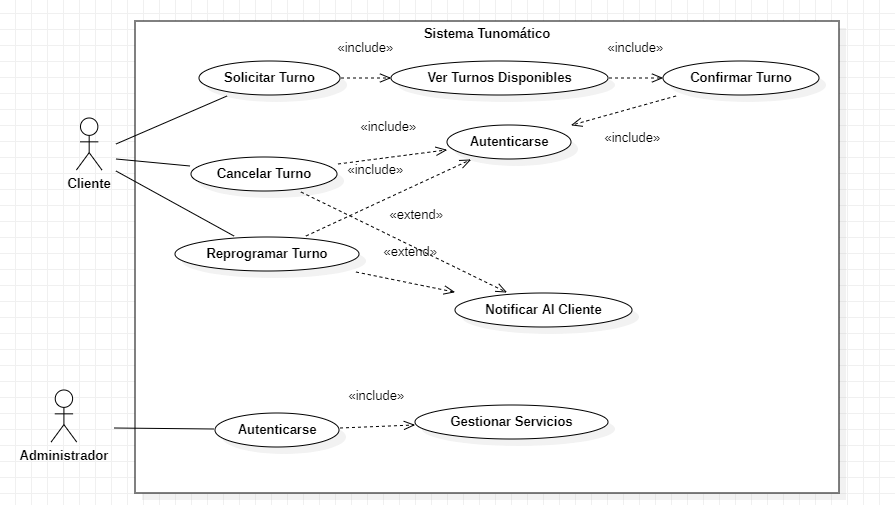
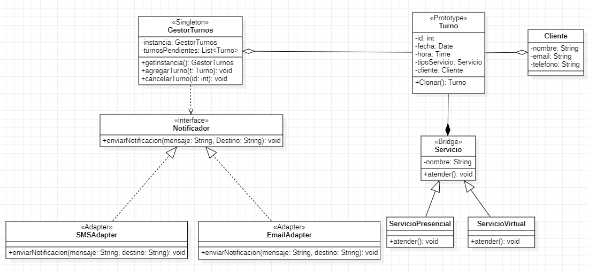
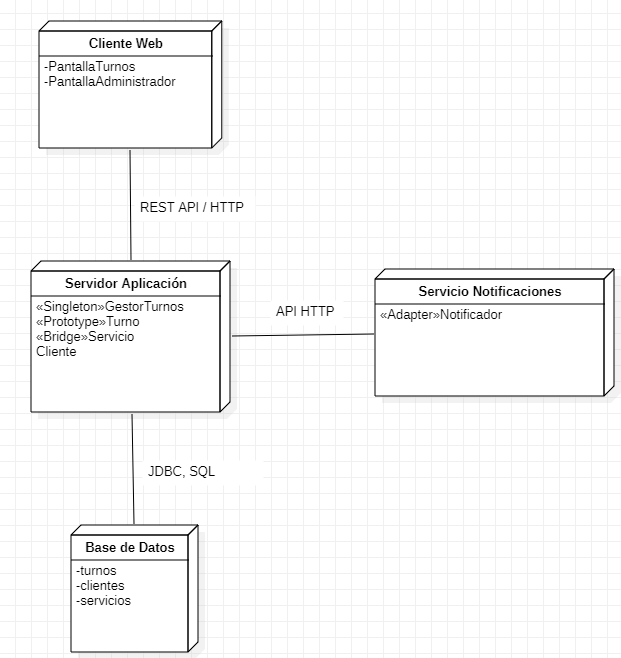

# 🧠 Descripción General del Sistema Tunomático
Nombre del Sistema: Tunomático – Sistema de Gestión de Turnos Digitales
Propósito: Facilitar la organización de turnos en entornos físicos (como clínicas, bancos, organismos públicos) mediante una interfaz digital, eliminando filas físicas, mejorando la experiencia del usuario y optimizando los recursos del establecimiento.
Actores Principales:

Cliente: Persona que solicita un turno.
Administrador: Usuario con permisos para modificar la configuración de turnos y gestionar servicios.
Sistema de Impresión: Nodo físico responsable de imprimir tickets físicos si es necesario.
Funciones principales:
Solicitar turno digital o físico.
Cancelar/reprogramar turno.
Mostrar turnos actuales en pantalla pública.
Administrar tipos de servicios disponibles (por el administrador).
Notificaciones por correo/SMS.

## 🎯 Casos de Uso

### ✅ Descripción

- **Actores principales:** Cliente, Administrador.
- **Casos de uso principales del cliente:** Solicitar turno, Ver turnos, Cancelar turno, Recibir notificación.
- **Casos de uso del administrador:** Crear servicio, Modificar servicio, Eliminar servicio, Atender turno, Ver turnos pendientes.

### 🔁 Relaciones UML

- `<<include>>`:
  - "Solicitar turno" **incluye** "Recibir notificación" (ya que siempre se notifica al cliente).
- `<<extend>>`:
  - "Ver turnos" **extiende** a "Cancelar turno" (cancelar solo si el turno existe y pertenece al cliente).
  - "Modificar servicio" **extiende** a "Crear servicio" (requiere uno ya existente como base).

---

## 🧩 Diagrama de Clases UML

### ✅ Descripción de la Arquitectura Lógica

Se aplicaron los siguientes patrones de diseño:

- `<<Singleton>>` en `GestorTurnos`: garantiza una única instancia centralizada para la gestión de turnos.
- `<<Prototype>>` en `Turno`: permite clonar turnos fácilmente cuando se generan múltiples citas con atributos similares.
- `<<Adapter>>` en `SMSAdapter` y `EmailAdapter`: encapsulan la lógica de envío de notificaciones y permiten cambiar el canal sin afectar el núcleo del sistema.
- `<<Bridge>>` entre `Servicio` y sus implementaciones `ServicioPresencial` y `ServicioVirtual`: desacopla la lógica de atención del tipo de servicio, facilitando nuevas formas de atención.

### 💡 Justificación

Este diseño separa claramente las responsabilidades: el gestor administra el flujo, los turnos encapsulan datos repetibles, las notificaciones son independientes y extensibles, y los servicios pueden crecer sin modificar el código existente.

---

## ⚙️ Diagrama de Implementación UML

### 🖥️ Nodos y Componentes

- `<<node>> ClienteWeb/Móvil`: Aplicación usada por los clientes para gestionar sus turnos.
  - Componentes: UI, ControladorCliente
- `<<node>> ServidorAplicación`: Backend central donde reside la lógica del sistema.
  - Componentes: GestorTurnos, Servicio, Notificador, Turno
- `<<node>> BaseDeDatos`: Sistema de persistencia (SQL) de turnos, clientes y servicios.
- `<<node>> ServicioDeNotificaciones`: Servicios externos como Email o SMS.
  - Componentes: EmailAdapter, SMSAdapter

### 🔗 Conexiones

- El cliente se comunica con el servidor vía REST API.
- El servidor interactúa con la base de datos mediante JDBC/ORM.
- El servidor usa los adaptadores para enviar notificaciones vía HTTP o SMTP a servicios externos.

##  🧱 Justificación Arquitectónica de los Patrones Aplicados
La arquitectura del sistema Tunomático se diseñó con el objetivo de mantener una estructura escalable, mantenible y desacoplada. Para ello, se aplicaron conscientemente los siguientes patrones de diseño:

### 🔒 Singleton (GestorTurnos)
El patrón Singleton fue implementado en la clase GestorTurnos para garantizar una única instancia global que coordine la asignación, consulta y cancelación de turnos. Esta decisión arquitectónica asegura el control centralizado del flujo de turnos, evitando inconsistencias o múltiples puntos de modificación que podrían comprometer la lógica del negocio.

### 🧬 Prototype (Turno)
El patrón Prototype se aplicó en la clase Turno para permitir la clonación eficiente de instancias al generar nuevos turnos a partir de configuraciones comunes. Esta elección es especialmente útil cuando múltiples clientes solicitan turnos similares y se requiere replicar objetos con ligeras modificaciones, sin construirlos desde cero.

### 🔌 Adapter (SMSAdapter, EmailAdapter)
Para integrar canales de notificación externos (como SMS y correo electrónico), se empleó el patrón Adapter. SMSAdapter y EmailAdapter actúan como envoltorios que adaptan la interfaz interna del sistema (INotificador) a servicios externos específicos. Esta separación permite cambiar de proveedor (por ejemplo, Twilio a Nexmo o SendGrid a SMTP) sin modificar el núcleo de la aplicación.

### 🌉 Bridge (Servicio, ServicioPresencial, ServicioVirtual)
La jerarquía de servicios se diseñó utilizando el patrón Bridge, separando la abstracción Servicio de sus implementaciones concretas (ServicioPresencial y ServicioVirtual). Este patrón permite modificar o extender la forma de atención sin afectar la lógica general de gestión, facilitando futuras extensiones como servicios híbridos o con atención asincrónica.

---

## 🧠 Reflexiones Finales

Durante el modelado arquitectónico de Tunomático se aplicaron patrones de diseño reconocidos, lo cual permitió:

- Reducir el acoplamiento entre módulos.
- Facilitar pruebas e implementación de nuevos canales de notificación.
- Asegurar que el sistema es fácilmente mantenible y escalable.

Este modelo refleja un sistema técnicamente justificable para implementación profesional en Java o C#.

---
